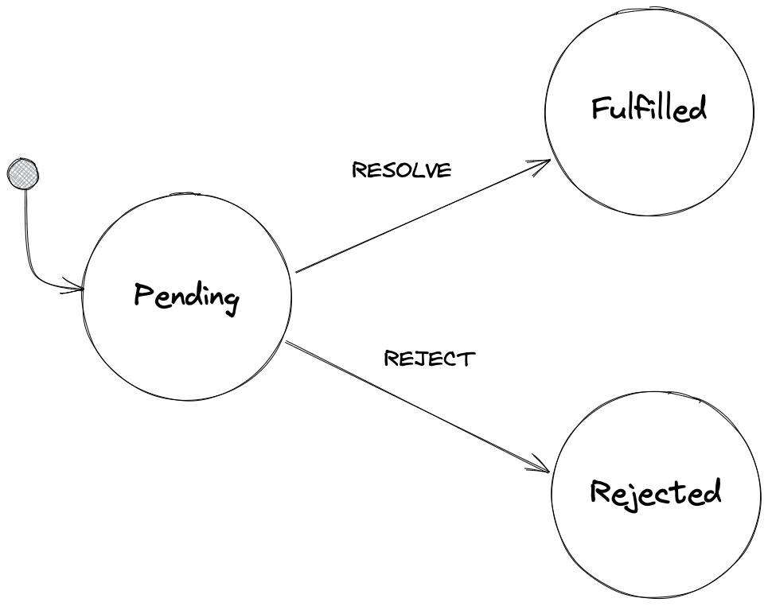
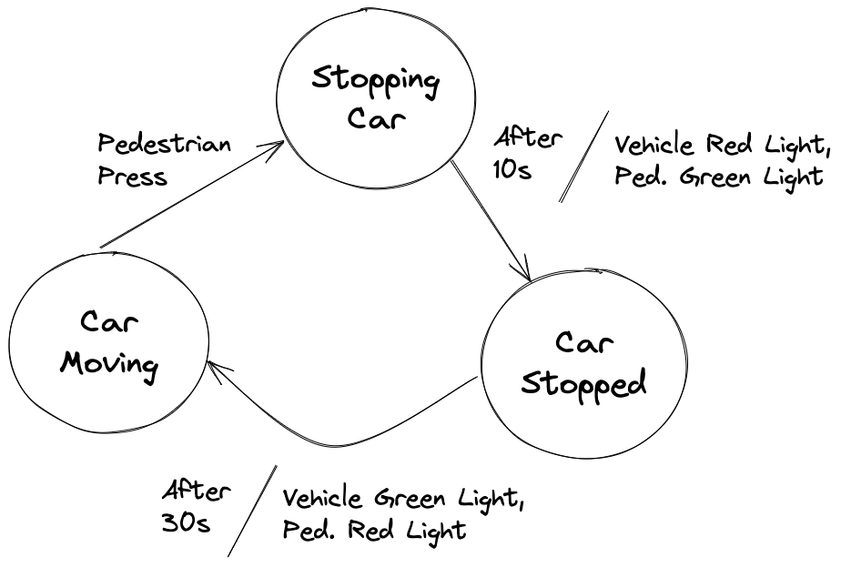

# xstate-examples

## Finite State Machine (FSM)

A finite state machine (FSM) is a **model** of a system which:

1. can only be in one of a given number of possible states at any moment
1. accepts input events that may outputs (actions) or a change in state.

FSM can be represented with state transition diagram.

<figure>
    
    <figcaption style="text-align:center;">Javascript Promise as FSM</figcaption>
</figure>

<figure>
    
    <figcaption style="text-align:center;">Traffic light as FSM. Note that a transition may have actions associated with it</figcaption>
</figure>

## Statechart

Statechart is an extension of FSM with adding concepts of nested states, history state, conditional transitions etc that allows modular modelling system behavior with abstraction.
